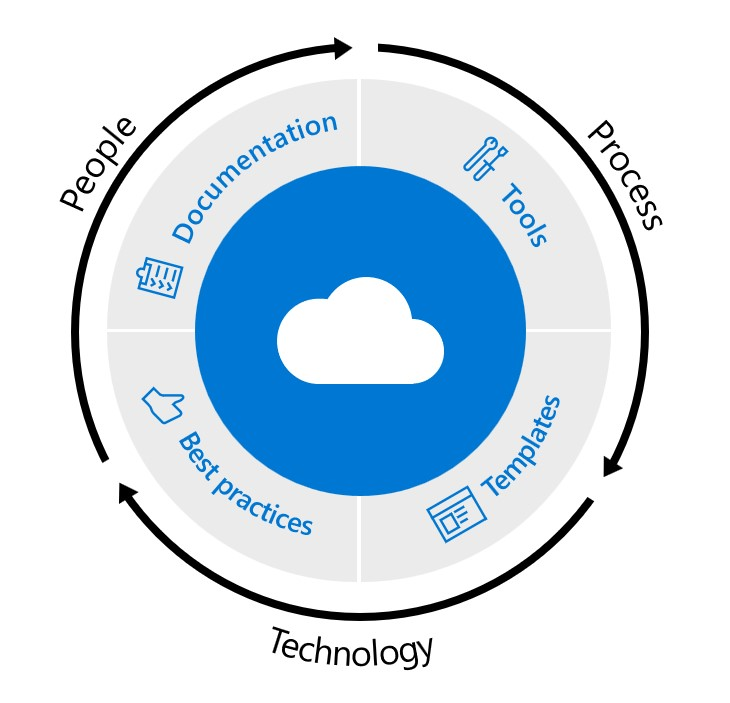

# Welcome to What the CAF!

What The CAF (WTC) is a learning path for Microsoft partners based on the Microsoft Cloud Adoption Framework for Azure (CAF). It is guidance that's designed to help partners create and use robust processes to ensure customer success across all phases building solutions on Azure, from the assessment phase to design, pilot, 
implementation, and post-implementation phases.

This learning path covers at depth these 5 pillars:

1. Cloud adoption business strategy & economics
2. Cloud adoption planning & skilling
3. Azure landing zones
4. Governance & tooling
5. Management & operations

Cloud architects, IT professionals, and BDMs use this information to achieve their cloud adoption goals.

Having Cloud Adoption experts in their organization enables the partner to become a trusted advisor not only to their customers, but also to Microsoft field teams. These “experts” continuously generate more value for customers by leveraging best practices, and helping these customers' better align their business and technical strategies to ensure success.

> **_For further information please_** [download this document](./sources/what-the-caf-lp-overview.pdf)

---

# The learning path

The learning path is based on an in-depth review of the Cloud Adoption Framework plus three main modules which include multiple hands-on activities in the form of labs, hackathons, and whiteboard design sessions. Please make sure to review all requirements here.

There are multiple sources to get a quick introduction into the Cloud Adoption Framework. Here's some of them:

- The Microsoft Cloud Adoption Framework for Azure module on [MS Learn](https://docs.microsoft.com/en-us/learn/modules/microsoft-cloud-adoption-framework-for-azure)

- The Microsoft Cloud Adoption for Azure series on [YouTube](https://www.youtube.com/playlist?list=PLlrxD0HtieHieP3AGObTE8YUpfS6bYtoY)

- The on-demand course in the [Microsoft Partner Network](https://partner.microsoft.com/en-us/training/assets/collection/cloud-adoption-framework-for-microsoft-azure#/).

---

## Module 1: Cloud Adoption 101

During this 2-day [course](/learning_path_modules/01_Cloud_Adoption_101_Workshop), you'll learn more about the Cloud Adoption Framework for Azure(CAF), which is a collection of documentation, implementation guides, best practices, and tools that represent recommended guidance from Microsoft and are designed to accelerate your customers' cloud adoption journey.

In this course, Microsoft subject matter experts will discuss the various methodologies in the framework, as well as the latest updates in key areas such as security, governance, and operations management.

The specific prerequisite of this training is an understanding of the Microsoft Azure Platform and Azure Fundamentals. After you attend this course, you can expect to understand the Cloud Adoption Framework methodologies and tools.

---

## Module 2: Define a Strategy & Build a Plan

This 1-day hackathon enables attendees to understand how the framework can be applied with customers. This hackathon walks through the 'Define Strategy and Plan phases' of CAF to support attendees in leading an engagement with a customer who is considering to move their digital assets to Azure.

By the end of this hackathon, attendees will have built a cloud adoption plan that they can use to present to a customer’s C-Suite to justify adopting the cloud. The purpose of this exercise is to provide attendees with the tools and understanding that will complement their conversations with their customers.

---

## Module 3: Migrate Like A Pro

In this 2-day hackathon, attendees will learn how to design a migration strategy for on-premises workloads to Azure.

At the end of this hackathon attendees will be better able to rationalize the migration of various workloads to Microsoft Azure as well as understanding how to determine the cost of hosting migrated workloads in Azure.

---

## Module 4: Azure Landing Zone Accelerator

In this 2-day hackathon, attendees will learn how the Azure landing zone accelerator enables their partner organization to make templatized landing zone deployments with baked-in repeatable best practices for governance, security, and compliance.

It comes with a set of design principles for managing the platform at scale; these principles serve as a compass for subsequent design decisions across critical technical domains.

At the end of this hackathon, attendees will be able to leverage the existing reference implementations, be able to build their own, assess and document landing zones, as well as understand how to establish policy-driven governance.

---
