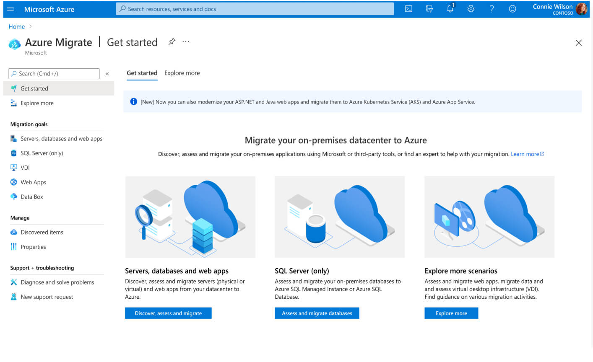

# What the CAF

## Module 03 - Migrate Like A Pro Hackathon

## Overview

Fabrikam Fabrics is a major manufacturer and distributor of clothing and soft furnishing materials. The CTO, James Lynch, was hired 6 months ago with a mandate to address ever-increasing IT costs. He has identified a sprawling IT estate, including a substantial legacy server footprint with 448 servers and VMs identified to date. There is a complex web of dependencies between servers and no-one has a clear view of the entire estate.

The board has approved a plan to migrate as much existing infrastructure as possible to Azure, to eliminate IT infrastructure overheads and 'clean house'. Your team has been tasked with planning and executing this migration.

In this 2-day hackathon, you will learn how to design a migration strategy for an on-premises environments to Azure, including the migration of web applications and databases.

At the end of this hackathon, you will be able to understand how to rationalize the migration of various workloads to Microsoft Azure as well as understand how to determine the cost of hosting migrated workloads in Azure.

----

## Prerequisites

### Before attending please review the requirements (self-paced online courses, certifications, Azure subscription) for this module listed [here](/agenda_and_requirements.md)

### Deploy the lab environment located [here](https://github.com/jonathan-vella/MCW-Line-of-business-application-migration/blob/master/Hands-on%20lab/Before%20the%20HOL%20-%20Line-of-business%20application%20migration.md) 1-day prior to attending.

---

## Guidance for Challenges 2-5

- A hands-on lab **step-by-step** guide is available [here](https://github.com/jonathan-vella/MCW-Line-of-business-application-migration/tree/master)
- A high-level **architecture diagram** for this lab is available [here.](/learning_path_modules/03_migrate_like_a_pro/media/azmgiratelab_architecture.png)
- The default username for the lab VM (SmartHotelHost) is "demosuer"; the password is "demo!pass123".

> Note: If **outbound RDP** connectivity is not allowed from your current location, you can either opt to peer networks (SmartHotelVNet <-> smarthotelhostvnet) or deploy Azure Bastion in the same VNET where your host is deployed. **Azure Bastion deployment time is of circa 20mins.** 

---

## Challenges

[Challenge 1 - WDS](./challenges/challenge1.md)
In this whiteboard design session, you will look at how we design an Azure migration for a heterogenous customer environment.

[Challenge 2 - Discover and Assess](./challenges/challenge2.md)
In this challenge you will be leveraging Azure Migrate to discover and assess on-premises servers for migration to Azure.

[Challenge 2a - Refactoring Databases](./challenges/challenge2a.md)
In this challenge you will be leveraging DMA to discover and assess on-premises SQL Server databases servers for migration readiness to Azure.

[Challenge 3 - Get Ready!](./challenges/challenge3.md)
In this challenge you will designing a Landing Zone which will support the initial migration.

[Challenge 4 - Migrate](challenges/challenge4.md)
In this challenge you will be migrate the customer facing website to Azure IaaS and the database to Azure PaaS.

[Challenge 5 - Modernize](challenges/challenge5.md)
In this challenge you will be assessing the customer facing website and then migrate the website to an Azure WebApp.
